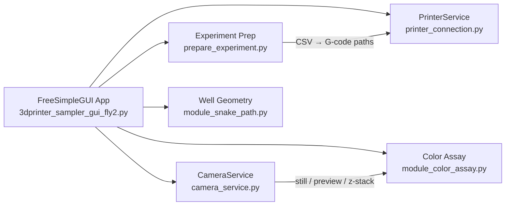

# ColorCam

**Automated well-plate imaging and colorimetric assay platform for Raspberry Pi.**

ColorCam repurposes a Marlin 3D printer as a programmable XYZ positioning stage and pairs it with a live camera feed to capture, analyze, and export per-well color data at scale. Built for biosensor and microbiology workflows at San Francisco State University.

---

## Capabilities

- **Automated multi-well experiments** — Load a CSV of XYZ coordinates and run picture or preview-only passes across every well, with pause, resume, and stop controls. Manual video capture is available via the **Vid** button.
- **Snake-path plate mapping** — Define four plate corners and generate a serpentine well path via bilinear interpolation (`module_snake_path.py`).
- **Crosshair ROI targeting** — Overlay a live crosshair circle on the camera preview and crop captures to the region of interest for consistent per-well measurements.
- **Quantitative color assay** — Measure trimmed-mean RGB per well and export color-delta values relative to control wells to CSV (`module_color_assay.py`).
- **Multi-round scheduling** — Run repeated full-plate passes with configurable intervals between rounds (`module_experiment_timer.py`).
- **Z-stack focal sweeps** — Capture a series of images across a Z range for focal-plane exploration.
- **Live exposure tuning** — RGB histogram, highlight-clip warnings, and manual exposure / white-balance controls in the Camera tab (`module_histogram.py`).
- **Multi-backend camera support** — Abstracts legacy `picamera`, `picamera2` / libcamera, and USB cameras via OpenCV (`camera_service.py`).
- **YAML-driven hardware profiles** — Swap printer and camera settings per lab setup without touching application code (`connection_settings.yaml`).

## Architecture



## Hardware

| Component | Notes |
|---|---|
| **Computer** | Raspberry Pi (Linux) with display for the GUI |
| **Camera** | Pi Camera Module, libcamera / `picamera2`, or USB camera via OpenCV |
| **Positioning stage** | Marlin-firmware 3D printer (Monoprice Maker Select, Ender 3, etc.) |
| **Connection** | Serial link — typically `/dev/ttyUSB0` or `/dev/ttyACM0` |

Tested lab profiles: **Cell Sensor**, **MHT**, and **FlyCamV2** (see `connection_settings.yaml`).

## Quick Start

### 1. Install dependencies

```bash
pip install FreeSimpleGUI opencv-python numpy pandas pyserial PyYAML
```

On Raspberry Pi, also install the camera backend for your hardware:

```bash
# Legacy Pi Camera
pip install picamera

# Pi Camera via libcamera (recommended on newer OS images)
pip install picamera2
```

Additional system packages may be required for X11 window management (`python3-xlib` on Debian-based images).

### 2. Configure your hardware profile

Edit [`connection_settings.yaml`](connection_settings.yaml) with your printer's serial port, baud rate, travel limits, and camera backend. Then set the active project in [`settings.py`](settings.py):

```python
PROJECT = "mht"  # or "cell_sensor", "FlyCamV2"
```

### 3. Launch the application

```bash
python 3dprinter_sampler_gui_fly2.py
```

### 4. Run an experiment

1. Load an existing well-path CSV, or generate one from the Movement tab (see Workflow below).
2. Choose picture or preview mode and set the output folder.
3. Press **Start Experiment**.

Color-assay CSV output is written automatically when running in picture mode.

## Workflow

### Calibrate (Movement tab)

Jog the printer with relative X/Y/Z controls or custom G-code. Set the crosshair radius to match your well size, capture the four plate corners, and click **Generate Snake CSV** to produce a serpentine path file.

### Configure (Camera tab)

Set still-image resolution, camera rotation, exposure mode (auto or manual ISO/shutter), white balance, and preview window geometry. Use the live RGB histogram to dial in exposure before starting a run.

### Run (Experiment tab)

Load your snake-path CSV, configure round count and interval, select picture or preview mode, and start. The application moves the stage to each well, dwells for stabilization, captures still images (and color-assay data in picture mode), and advances. Stop or pause at any time without restarting the GUI.

## Project Layout

```
3dprinter_sampler_gui_fly2.py   # Main GUI application
camera_service.py               # Camera backend adapter (picamera / libcamera / USB)
printer_connection.py             # Serial G-code printer control
printer_service.py              # Lightweight printer service wrapper
prepare_experiment.py           # CSV loading, G-code conversion, folder management
module_color_assay.py           # Per-well RGB measurement and color-delta export
module_snake_path.py            # Bilinear snake-path CSV generation
module_well_location_helper.py  # Crosshair overlay and circular ROI cropping
module_histogram.py             # Live RGB histogram rendering
module_experiment_timer.py      # Multi-round scheduling UI and validation
connection_settings.yaml        # Per-lab printer and camera profiles
settings.py                     # Project selector and YAML loader
```

The `testing/` directory contains development scripts and sample data; it is not required for normal operation.

## Credits

Originally developed by **Johnny Duong** (San Francisco State University) for the **Cell Sensor** and **MHT** projects in the **Esquerra Lab**.

## License

[MIT](LICENSE) — Copyright (c) 2025 Esquerra Lab SFSU
